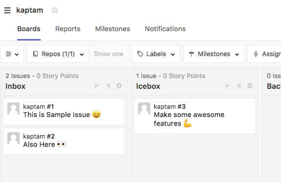

## peekabow

Peek your repo's summary of ZenHub pipeline :baby:

If you have ZenHub board such as:



Then you can show the summary of pipeline:

```
$ peekabow --owner laprasdrum --repo kaptam -pipeline Inbox issues
🔽  laprasdrum/kaptam: Inbox's issues here:
#1: This is Sample Issue 😄 : https://github.com/laprasdrum/kaptam/issues/1
#2: Also Here 👀 : https://github.com/laprasdrum/kaptam/issues/2
```

## Installation

Make sure you have a working Go environment.  Go version 1.9.2+ is supported.  [See
the install instructions for Go](http://golang.org/doc/install.html).

To install peekabow, simply run:
```
$ go get github.com/laprasdrum/peekabow
```

Make sure your `PATH` includes the `$GOPATH/bin` directory so your commands can
be easily used:
```
export PATH=$PATH:$GOPATH/bin
```

## Usage

Before start, you should see & fix [a template toml file](./config.toml.template).

```
peekabow [global options] command [command options] [arguments...]

COMMANDS:
     issues, i  show your repo's pipeline issue summary
     help, h    Shows a list of commands or help for one command

GLOBAL OPTIONS:
   --owner value, -o value     repository owner
   --repo value, -r value      repository name
   --pipeline value, -p value  pipeline name of ZenHub
   --verbose                   show debug log
   --help, -h                  show help
   --version, -v               print the version
```
